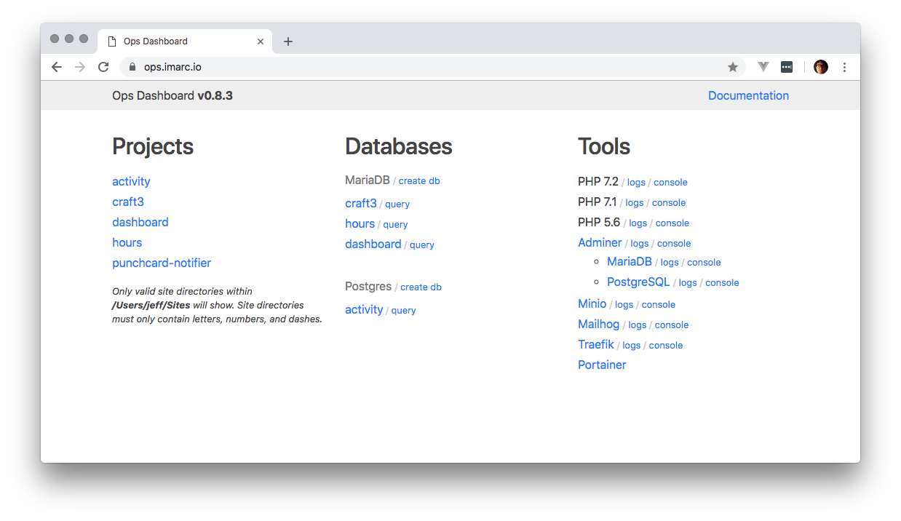

# Ops

**Version 0.4.6**

- A local development environment focused on PHP-based projects.
- Create a new host by making a directory.
- Local HTTPS with self-signed certs.
- Shared services: MariaDB, PostgreSQL, Redis, Mailhog, Adminer, and more.
- Built on Docker and Traefik. Configure project-specific services when required.

## Prerequisites

Ops supports Linux, Mac, and Windows Subshell Linux (WSL)

`bash`, `npm`, `docker`, and `docker-compose` are required.

`ssh` and `rsync` are highly recommended.

### Linux Installation Instructions

- [Install Docker CE](https://docs.docker.com/engine/installation/linux/)

### Mac Installation Instructions

- [Install Docker for Mac](https://docs.docker.com/docker-for-mac/install/)

### Windows Subshell for Linux

- [Install Docker for Windows](https://docs.docker.com/docker-for-windows/install/)
- [Install Docker Client](https://medium.com/@sebagomez/installing-the-docker-client-on-ubuntus-windows-subsystem-for-linux-612b392a44c4)

## How To Install

Install with npm:

    npm install -g git+ssh://git@gitlab.imarc.net:imarc/ops.git

## Create Your First Project

**On first run, you will be asked your password in order to trust the newly generated self-signed certs for HTTPS support**

To start ops services, run `ops start`

To add a new project, create a directory within $HOME/Sites. Your local project will then be available at https://{directory}.imarc.io.

The project directory name can only contain letters, numbers, and dashes ([A-Za-z0-9-]+). If one of the following directories is found within a project, it will be used as the document root: `public`, `web`, `public_html`, `htdocs`, or `docroot`.

To stop ops, run `ops stop`

## The Dashboard

The dashboard available at [https://ops.imarc.io](https://ops.imarc.io) will show you all projects and let you manage services.

## The Services

You can connect your app to the following shared services:

**MariaDB 10.3** 
hostname: mariadb 
username: root 
password: *none* 
port: 3306

**PostgreSQL 9.6** 
hostname: postgres 
username: postgres 
password: *none* 
port: 5432

**Redis 3.2** 
hostname: redis 
port: 6379

**Memcached 1.4** 
hostname: memcached 
port: 11211

**Minio** 
hostname: minio 
access key: minio-access 
secret key: minio-secret 

**Mailhog** 
*SMTP Config:* 
hostname: mailhog 
port: 1025

## External Dependencies

Out of the box, the main/shared PHP container relies on the imarcagency/php-apache image.

This is a separate project and can be viewed on [Github](https://github.com/imarc/docker-php-apache) or [Docker Hub](https://hub.docker.com/r/imarcagency/php-apache/)

## Custom Project Container

*This is for advanced users and it would be best to have a solid understanding of docker and docker-compose files
before moving forward with implementing this solution*

There are times where you want to configura a custom container to run your project. This could be due to:

- Your project needs a special PHP configuration or extension.
- Your project need to lock down the PHP version or use a specific image.
- You are using a language that isn't PHP.

With a little configuration, Ops allows you to run a custom container beside the shared services. Ops' `project`
subcommands deal with project specific compose commands. Running `ops project start` within a project directory
will load a `ops-compose.yml` file. The compose files that are loaded can be
configured with the `OPS_COMPOSE_FILE` option.

Here is a generic ops-compose.yml file:

    version: '2'

    services:
      craft:
        image: imarcagency/php-apache:2

        labels:
          - "ops.linked=true"
          - "traefik.enable=true"
          - "traefik.docker.network=ops_gateway"
          - "traefik.frontend.rule=Host:${OPS_PROJECT_NAME}.${OPS_DOMAIN}"
          - "traefik.port=80"
        environment:
          - "APACHE_UID=${OPS_DOCKER_UID}"
          - "APACHE_GID=${OPS_DOCKER_GID}"
          - "APACHE_ROOT=/var/www/public"
        volumes:
          - "./:/var/www/:cached"
        networks:
          - default
          - ops_gateway
          - ops_backend

    networks:
      ops_gateway:
        external: true
      ops_backend:
        external: true

The most important things are the labes and the networks.
Those settings are required for the proxy to function or for your app to conenct to shared services.
Everything else can be customized to whatever your app requires.

See all the variables that get injected into this file [here](https://gitlab.imarc.net/imarc/ops/blob/master/ops.sh#L337)

## Contributing

If you are developing ops itself, debugging, or want to try out bleeding edge features, It is recommended you install like so:

    # clone into a local dir and enter dir
    git clone git@gitlab.imarc.net:imarc/ops.git
    cd ops

    # create 'ops' symlink to your repo
    npm install -g .

This means your global ops script will point directly to the repo and you can make changes on the fly.

## License

MIT License

Copyright (c) 2018 Imarc
